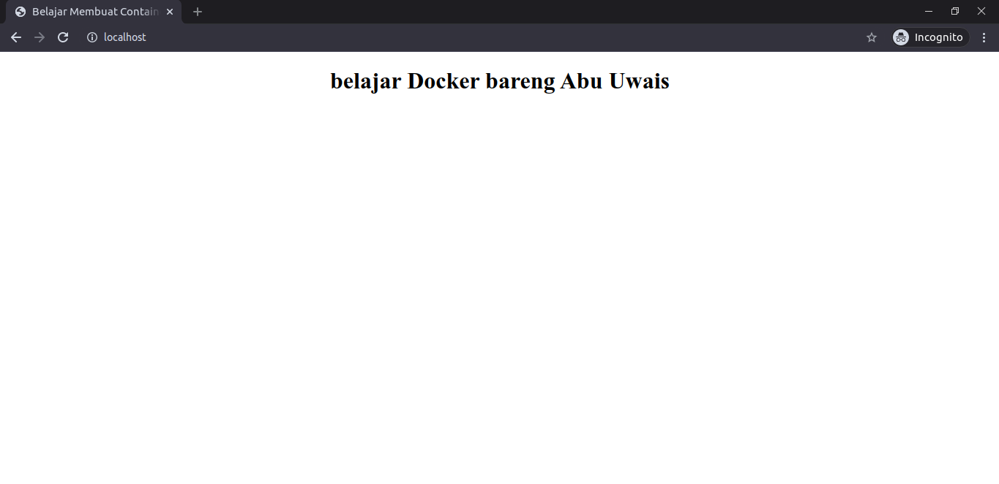

# Membuat Container Image Nginx Alpine Linux


### Clone

```
$ git clone git@github.com:utit/simple-container-image.git
```

### Build

```
$ docker build -t alpine-nginx:uwais .
```

### Run

```
$ docker run -d -p 80:80 alpine-ninx:uwais
```

### Test

```
$ curl -XGET localhost
```

Via browser


